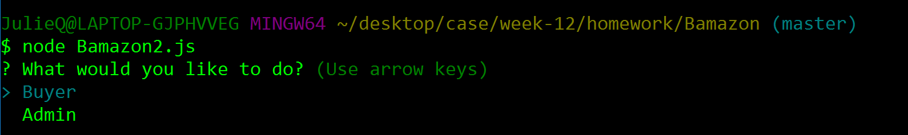
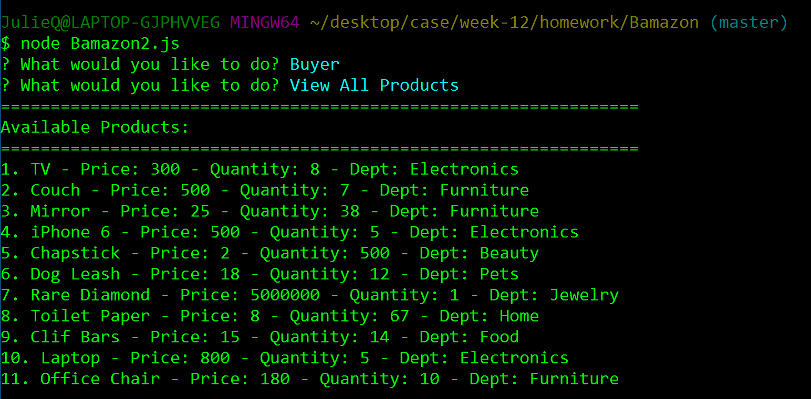

# Project Title

Bamazon

## Description

This is a node based CLI app that allows the user to buy items on bamazon. There are two user types: buyer or admin.  In the buyer section, the app will take in orders from customers and deplete stock from the store's inventory if there is enough inventory to support the order.  In the admin section, the admin can add or remove products.  

## NPM Installs

- Inquirer
- Mysql
- Bluebird

## Key Functions

### Buyer commands

- "View all products"
-- Lists available products by name, department, price, and stock quantity.

- "Purchase an Item" 
-- The buyer is shown the list of products and is asked the quantity of the product they would like to purchase.  

-- If there is enough stock, the buyer will be told the total purchase price and the stock quantity is updated in MySQL.  

(stock of purchased item decreased by quantity purchased)

-- If there is not enough stock, the buyer will be told that there is insufficient stock available and the purchase will not go through.

### Admin commands

- "View all products"
-- Lists available products by name, department, price, and stock quantity.

- "Add an Item"
-- Prompt the admin to add a new product with a name, department, price, and stock quantity and then query the database with the addition

- "Remove an Item"
-- Show the admin a list of products and ask which they would like to remove and then query the database with the deletion.

### Needed Updates

- Need to update the item_id when the admin removes a product from bamazon

## Built With

- Node JS
- Inquirer to handle prompts
- MySQL to store data

## Authors

Julie Quinn, July 2017 

